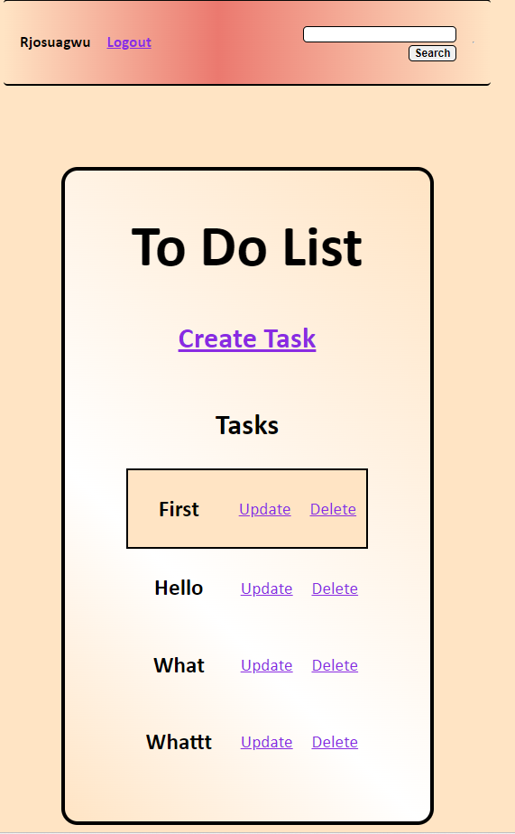

# To-Do-List

Brief description of your project.

## Table of Contents
- [Introduction](#introduction)
- [Features](#features)
- [Technologies Used](#technologies-used)
- [Usage](#usage)
- [License](#license)
- [Contact](#contact)

## Introduction
The Django To-Do List project is a versatile web application designed to help users efficiently manage their tasks. By seamlessly combining user authentication, task creation, updating, and deletion, along with a user-friendly search feature, this application simplifies the process of organizing and prioritizing daily activities. This project addresses the common challenge of keeping track of tasks and ensures a user-friendly experience. Whether you want to create a to-do list, update existing tasks, or search for specific items, this application offers a practical solution. It showcases the power of Django for web development, emphasizing user convenience and efficient task management.

## Features
User Authentication: Ensure secure access with user authentication.
Task Management: Efficiently create, update, and delete tasks.
Search Functionality: Swiftly find tasks by their titles.
User-Friendly Messaging: Clear feedback for user actions.
Django-Powered: Showcasing Django's web app development prowess.

## Technologies Used
Django
Python
HTML and CSS
SQLite Database
Git and GitHub
User Authentication
Django Forms
Django Messages Framework

## Usage

## License
Specify the license under which your project is distributed. For example:
This project is licensed under the [MIT License](LICENSE).

## Contact
https://www.linkedin.com/in/richard-osuagwu-37243324b/
